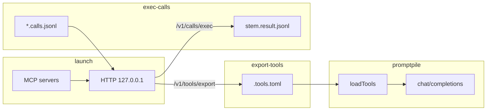

# promptpile-mcp

**promptpile** 的可选 **Model Context Protocol (MCP)** 适配层：把 MCP 服务器暴露的工具 Schema 转为 OpenAI Chat Completions 的 `tools` 形态，与 promptpile 现有「静态工具 + 合并扩展」流程衔接。

**完整技术设计（CLI、`mcp.toml`、HTTP API、工作流）见 [DESIGN.md](./DESIGN.md)。**

**当前状态**：**`launch`** 在本机 **`127.0.0.1`** 提供 **Koa** HTTP 网关；**`export-tools`** 已实现（`GET /v1/tools/export` → 扁平 `.tools.toml`）；**`exec-calls`** 已实现：**目录模式**仅扫描 **`--dir`** 第一层的 **`*.calls.jsonl`** 并写 **`stem.result.jsonl`**；**单文件模式**用 **`--input`** 指定一个 **`.calls.jsonl`**，**`--output`** 可省略（默认同目录 **`stem.result.jsonl`**）。**`--input` 与 `--dir` 互斥**；未指定 `--dir` 时目录模式仍默认扫描当前工作目录。**默认**跳过已有配对 result；**`--overwrite-results`** 覆盖。result 文件通过同目录临时文件 + `fsync` + `rename` 原子提交，失败时不会留下半截正式文件；每行额外保存工具级 `execution` 元数据。详见 [DESIGN.md §6](./DESIGN.md#6-callsjsonl-与结果文件)。当 **`mcp.toml` 含 `[servers.*]`** 时，**`launch`** 使用 **`createMcpGatewayBackend`**（stdio **`initialize` / `tools/list` / `tools/call`**）；**无 `[servers]`** 时仍为 **stub** 后端（与 [test-fixtures/minimal.toml](./test-fixtures/minimal.toml) 兼容）。另有 **`npm run mcp:smoke`** 做独立 stdio 冒烟（见 [开发与构建](#开发与构建)）。网关按 `[execution]` 并发执行 calls，支持单调用超时、客户端断开取消、`continue | fail_fast` 失败策略，以及仅对显式安全工具启用的瞬时故障重试。需要 **Node.js 18+**（内置 `fetch` / `AbortController`）。

---

## 目录

- [CLI 概要](#cli-概要)
- [定位](#定位)
- [与 promptpile 的衔接点](#与-promptpile-的衔接点)
- [阶段 A：把 MCP 当作工具 Schema 提供者](#阶段-a把-mcp-当作工具-schema-提供者)
- [阶段 B：可选的执行路径](#阶段-b可选的执行路径)
- [配置形态](#配置形态)
- [集成方案](#集成方案)
- [安全](#安全)
- [后续待办](#后续待办)
- [开发与构建](#开发与构建)
- [许可证](#许可证)

---

## CLI 概要

**当前提供**四条子命令（详见 [DESIGN.md §3](./DESIGN.md#3-cli-规格)）：

| 命令 | 作用 |
|------|------|
| **`launch`** | 加载 `mcp.toml`，启动 MCP 子进程与会话，监听 **本机 HTTP** 网关。 |
| **`export-tools`** | 连接网关 `--base-url`，拉取工具列表并写入 **`.tools.toml`**（默认当前目录）；可选 **`--token`** 用于 Bearer 鉴权。 |
| **`exec-calls`** | 连接网关：**目录模式** `--dir`（未指定时为 cwd）仅扫描第一层 **`*.calls.jsonl`**；**单文件模式** **`--input`**（与 **`--dir`** 互斥），**`--output`** 可选；原子写 **`stem.result.jsonl`**；默认跳过已有 result；**`--overwrite-results`** 覆盖；可选 **`--token`**；**`--timeout-ms`** 控制每个 calls 文件的 HTTP 总超时。 |
| **`check`** | 检查一个 `--input <file.calls.jsonl>` 及其配对 result，输出 `pending | partial | complete | invalid`；不执行工具，也不修改文件。 |

`launch` 的 **`port`** / **`token`** 可由命令行或 `mcp.toml`（如 `[gateway]`）提供：**命令行优先**；**`port` 合并后必填**；**`token` 可选**，仅在有值时启用网关 Bearer 鉴权。**`export-tools`** / **`exec-calls`** 在网关已启用鉴权时通过 **`--token`** 传入同一密钥，请求头 **`Authorization: Bearer <token>`**。

---

## 定位

| 项目 | 说明 |
|------|------|
| **promptpile** | 从消息目录组装 `messages`，可选附带 `tools`，调用 **单次** `chat/completions`；**不执行**工具函数；工具历史通过 `[idx]assistant.calls.jsonl` / `[idx]assistant.result.jsonl` 等文件还原。 |
| **本包** | 通过 HTTP 网关持有 MCP 会话，将 `tools/list` 映射为 Chat Completions 的 `function` 工具定义，并（可选）经 `tools/call` 执行调用；**不修改** promptpile 源码（见 [集成方案](#集成方案)）。 |

---

## 与 promptpile 的衔接点

实现 MCP 工具列表前，需对齐 promptpile 里已有的两条路径：

1. **静态工具加载** — [`packages/promptpile/src/tools-loader.ts`](../promptpile/src/tools-loader.ts) 的 `loadTools()`：从显式 **`.toml`**（可含 `extends`）或 `--tools-file` 解析出 OpenAI 形的 `tools[]`；**仅**包含用户/导出定义的工具，无内置 Glob/Grep。

MCP 集成：通过 **`export-tools`** 写入 `.tools.toml`，使用稳定前缀（如 `mcp__<serverId>__<toolName>`），避免与静态工具重名。详见 [DESIGN.md §7](./DESIGN.md#7-工具命名与去重)。

---

## 阶段 A：把 MCP 当作工具 Schema 提供者

**目标**：通过 **`launch`** 网关对已配置的 MCP 服务维持会话并拉取工具列表，映射为：

```json
{ "type": "function", "function": { "name": "...", "description": "...", "parameters": { ... } } }
```

其中 **`parameters`** 对应 MCP 工具条目中的 **`inputSchema`**（通常为 JSON Schema 对象），与 OpenAI function calling 约定一致。

**协议步骤**（每个 MCP server）：

1. 建立传输（首版以 **stdio** 为主：`command` + `args` 子进程）。
2. `initialize` → 就绪后 `tools/list`。
3. 将每条 MCP tool 转为一条 `ToolDefinition`（与 promptpile 中 `ToolDefinition` 用法一致）。

**命名与去重**：见 [DESIGN.md §7](./DESIGN.md#7-工具命名与去重)。

**失败策略**（可配置于 `mcp.toml`，见 [DESIGN.md §4.3](./DESIGN.md#43-mcp-server-失败策略)）：

- **strict**：任一 server 握手或列表失败则 **`launch` 启动失败**。
- **best-effort**：跳过失败的 server 并记录日志；至少一个 server 成功则网关继续运行。

---

## 阶段 B：可选的执行路径

promptpile 单次运行仍是一次补全；**执行**模型返回的 `tool_calls` 不在 core 内完成时，可选用以下方式之一：

| 方式 | 说明 |
|------|------|
| **`exec-calls` + 网关** | 目录扫描或 **`--input`** 单文件；经 **`POST /v1/calls/exec`**，写 **`stem.result.jsonl`**（详见 [DESIGN.md §6](./DESIGN.md#6-callsjsonl-与结果文件)）。 |
| **`check`** | 只读检查 calls/result 是否未执行、部分完成、完整或无效；用户确认后再手动覆盖重试。 |
| **手工 / 脚本结果文件** | 与现有约定一致：将工具结果写入 `[idx]assistant.result.jsonl`。示例：`example/promptpile-tool-test/scripts/execute-tool-call.ts`。 |
| **after-hook** | promptpile 完成后执行钩子；环境变量见 [`after-hook.ts`](../promptpile/src/after-hook.ts)；钩子内可调用 `exec-calls`。 |
| **内置多轮 `--mcp-exec`**（远期） | 在 promptpile 进程内循环执行工具直到无 `tool_calls`。实现与安全成本高，**不与首版网关同步**。 |

---

## 配置形态

建议与 Cursor / 生态常见形态对齐：

| 来源 | 说明 |
|------|------|
| **`mcp.toml`** 或 **`.mcp.json`** | 至少包含 `servers`；网关 **`port` / `token`** 可置于 `[gateway]`；可选顶层 **`version`**（默认 1）；**`[gateway].port`** 可为整数或数字字符串（见 [DESIGN.md §4](./DESIGN.md#4-mcptoml-配置) 解析约定）。 |
| **环境变量** | 例如 `MCP_CONFIG` 指向配置文件路径。 |
| **`launch`** | `--config` / `--port` / `--token`。 |

**优先级**：**命令行 > 配置文件 > 环境变量与默认路径**（细则见 [DESIGN.md §3.1](./DESIGN.md#31-launch)）。

**每个 server 建议字段**：

| 字段 | 说明 |
|------|------|
| `command` / `args` | stdio 传输下的可执行文件与参数 |
| `env` | 可选，子进程环境 |
| `cwd` | 可选，工作目录 |
| `init_timeout_ms` / `list_timeout_ms` | 握手与列表超时（可继承 `[defaults]`） |
| `transport` | 可选；当前仅 **`stdio`**（缺省） |

执行策略示例：

```toml
[execution]
concurrency = 4
call_timeout_ms = 60000
failure_policy = "continue"      # continue | fail_fast
retry_max_attempts = 1          # 1 表示不重试
retry_base_delay_ms = 250
retry_safe_tools = ["mcp__fs__read_file"]
```

`fail_fast` 在首个失败结果后停止调度新调用；已经开始的调用会正常收尾。CLI 收到 `SIGINT` / `SIGTERM`、HTTP 客户端断开或 `--timeout-ms` 到期时会取消在途请求，且不会提交该 calls 文件的 result。 result JSONL 每行的 `execution` 对象记录 `ok`、`attempts`、`duration_ms`，失败时还记录 `error`；promptpile 回放会忽略这些扩展字段。

已有 result 不完整或无效时，`exec-calls` 只打印 warning 并跳过，不自动恢复。检查和手动重试示例：

```bash
promptpile-mcp check --input path/to/turn.calls.jsonl
promptpile-mcp exec-calls --base-url http://127.0.0.1:8765 \
  --input path/to/turn.calls.jsonl --overwrite-results
```

`check` 退出码：`complete = 0`，`pending/partial = 1`，`invalid = 2`。

**`[behavior].failure_policy`** 须为 **`strict`** 或 **`best-effort`**，只控制 MCP server 启动失败。**`[execution]`** 控制 calls 执行：`concurrency`、`call_timeout_ms`、`failure_policy = "continue" | "fail_fast"`、`retry_max_attempts`、`retry_base_delay_ms`、`retry_safe_tools`。重试默认关闭（`retry_max_attempts = 1`），且只有 `retry_safe_tools` 中按导出名称精确匹配的工具才会对超时或瞬时传输故障重试；MCP 返回的业务错误不会重试。**`[servers.<id>]`** 表键须匹配 **`[A-Za-z0-9_-]+`** 且 **不得含 `__`**（与网关 **`mcp__<id>__<tool>`** 反解析一致，详见 [DESIGN.md §7](./DESIGN.md#7-工具命名与去重)）。包内运行 **`npm test`** 可跑配置解析、工具路由、并发执行、取消/超时、安全重试和原子写入单测。

---

## 集成方案

**选定路线**：**常驻 `launch` 网关 + `export-tools` 生成 `.tools.toml` + `exec-calls` 处理调用**。不把 MCP 合并逻辑写进 [`packages/promptpile/src/index.ts`](../promptpile/src/index.ts)。

### 工作流

1. `promptpile-mcp launch --config mcp.toml`（并指定或配置 **`port`**）。
2. `promptpile-mcp export-tools --base-url http://127.0.0.1:<port> [-o .tools.toml]`
3. `promptpile --tools-file .tools.toml ...`
4. 若模型产生 tool calls：`promptpile-mcp exec-calls --base-url http://127.0.0.1:<port> [--dir <目录>]`，或单文件：`exec-calls --base-url … --input path/to/x.calls.jsonl [--output path/to/x.result.jsonl]`

**优点**：不改 promptpile；网关复用 MCP 会话；工具列表在重新 `export-tools` 前可能滞后于 MCP 侧变更。



### 未选方案：库合并进 promptpile

在 promptpile 进程内动态拉取 MCP 工具：一条命令即可，但需改 promptpile 与依赖生命周期。**当前不采用**；使用 **`export-tools` → `.tools.toml` → `--tools-file`**。

---

## 安全

- **stdio MCP = 执行任意命令**：仅使用可信 `mcp.toml`；勿提交含密钥的 `env`。
- **HTTP 网关**：默认本机回环；共享环境建议配置 **`token`**。详见 [DESIGN.md §9](./DESIGN.md#9-安全)。
- **网络类 MCP**（HTTP/SSE 等，若后续支持）：需 TLS、允许列表与超时。

---

## 后续待办

- [x] 引入 `@modelcontextprotocol/sdk`；stdio 会话封装见 [`src/mcp/stdio-session.ts`](./src/mcp/stdio-session.ts)，网关聚合见 [`src/http/mcp-backend.ts`](./src/http/mcp-backend.ts)。
- [x] **`launch`** 在配置含 **`servers`** 时接入真实 MCP；否则 stub。
- [x] after-hook 示例与环境变量说明（见下文 **After-hook**）。

---

## After-hook（与 promptpile 联用）

promptpile 在运行结束时可执行钩子脚本，并向子进程注入环境变量（实现见 [`packages/promptpile/src/after-hook.ts`](../promptpile/src/after-hook.ts) 中 **`buildPromptpileHookEnv`**）。与本网关联用时，建议在钩子中自行约定 **`PROMPTPILE_MCP_BASE_URL`**（及可选 **`PROMPTPILE_MCP_TOKEN`**），再调用 **`promptpile-mcp exec-calls`**。

| 变量（promptpile 注入） | 含义 |
|-------------------------|------|
| **`PROMPTPILE_SCAN_DIRECTORY`** | 扫描目录（消息目录）绝对路径 |
| **`PROMPTPILE_HAS_TOOL_CALLS`** | 本次输出是否含 **`tool_calls`**：`1` / `0` |
| **`PROMPTPILE_CALLS_FILE`** | 主输出旁 **`*.calls.jsonl`** 路径（有调用时；否则为空） |
| **`PROMPTPILE_OUTPUT_FILE`** | 主输出文件路径 |

| 变量（自建，示例脚本约定） | 含义 |
|---------------------------|------|
| **`PROMPTPILE_MCP_BASE_URL`** | 已运行的 **`launch`** 网关根 URL，例如 **`http://127.0.0.1:8765`** |
| **`PROMPTPILE_MCP_TOKEN`** | 可选，与 **`mcp.toml`** **`[gateway].token`** 一致 |

示例 Bash 脚本（可复制到项目根并 **`chmod +x`**，或在 promptpile 配置里指向该路径）：[`docs/after-hook.example.sh`](./docs/after-hook.example.sh)。逻辑：若 **`PROMPTPILE_HAS_TOOL_CALLS=1`** 且 **`PROMPTPILE_MCP_BASE_URL`** 已设置，则 **`exec-calls --dir "$PROMPTPILE_SCAN_DIRECTORY"`**。

**Windows（PowerShell）**：可在钩子中设置 **`$env:PROMPTPILE_MCP_BASE_URL='http://127.0.0.1:8765'`** 后调用 **`npx promptpile-mcp exec-calls ...`**；环境变量名与 Bash 相同。

---

## 开发与构建

```bash
cd packages/promptpile-mcp
npm install
npm run build
```

### 回归检查（结项验收）

合并或发版前建议按需执行：

1. **必跑**：**`npm run test`**（内含 **`npm run build`**，再跑 Node **`node:test`**：`mcp-config`、`tool-name` 单元测试；退出码须为 **0**）。
2. **可选**：**`npm run test:smoke`**（先构建，再跑下文 **`mcp:smoke`**；依赖 **`npx`**，首次可能下载包，需联网）。
3. **可选**：端到端网关——配置含 **`[servers.*]`** 的 **`mcp.toml`** 启动 **`launch`**，另一终端 **`export-tools`** 或 **`curl`** 访问 **`GET /health`**、`GET /v1/tools/export`（详见下文 **`launch` + 真实 MCP**）。

### MCP stdio 冒烟（阶段 1）

在 **`npm run build`** 之后，用官方 filesystem server 验证 **连接 → `tools/list` → 退出**（未传 **`--command`** 时脚本会默认执行 **`npx -y @modelcontextprotocol/server-filesystem <临时目录>`**，首次运行会下载包，需联网）：

```bash
npm run mcp:smoke
```

指定自定义 MCP 进程（示例：与本仓库无关的任意 stdio server）：

```bash
npm run mcp:smoke -- --command npx --args -y --args @modelcontextprotocol/server-filesystem --args C:\path\to\allowed\dir
```

也可用环境变量简化参数：**`PROMPTPILE_MCP_SMOKE_COMMAND`**、**`PROMPTPILE_MCP_SMOKE_ARGS`**（值为 **JSON 数组字符串**，例如 `["-y","@modelcontextprotocol/server-filesystem","C:\\temp\\mcp-root"]`）。可选 **`--call <toolName>`** 与 **`--call-args '{"path":"..."}'`** 在列出工具后再调用一次 `tools/call`。详见 **`node dist/scripts/mcp-smoke.js --help`**。

### `launch` + 真实 MCP（验收）

在 **`mcp.toml`** 中配置 **`[servers.<id>]`**（至少一个），例如：

```toml
[gateway]
port = 8765

[servers.fs]
command = "npx"
args = ["-y", "@modelcontextprotocol/server-filesystem", "C:\\temp\\mcp-allowed"]
```

然后 **`npm run build`**，终端 A：**`promptpile-mcp launch --config <路径>`**（可加 **`--port`** 覆盖）；终端 B：**`promptpile-mcp export-tools --base-url http://127.0.0.1:8765`** 应得到非空 **`.tools.toml`**。失败策略、超时、**`flat_names`** 见 [DESIGN.md §4](./DESIGN.md#4-mcptoml-配置)。

运行 **`export-tools`** / **`exec-calls`** 需要 **Node.js 18+**（内置 `fetch` / `AbortController`）。

本地 CLI：

```bash
npx promptpile-mcp --help
```

`launch` 启动网关后，可在另一终端执行 **`promptpile-mcp export-tools --base-url http://127.0.0.1:<port> [-o .tools.toml] [--token …]`** 生成工具文件。亦可继续用 `curl` 验收 HTTP（见 [DESIGN.md](./DESIGN.md) §5）；示例配置见 [test-fixtures/minimal.toml](./test-fixtures/minimal.toml)。

---

## 许可证

ISC
